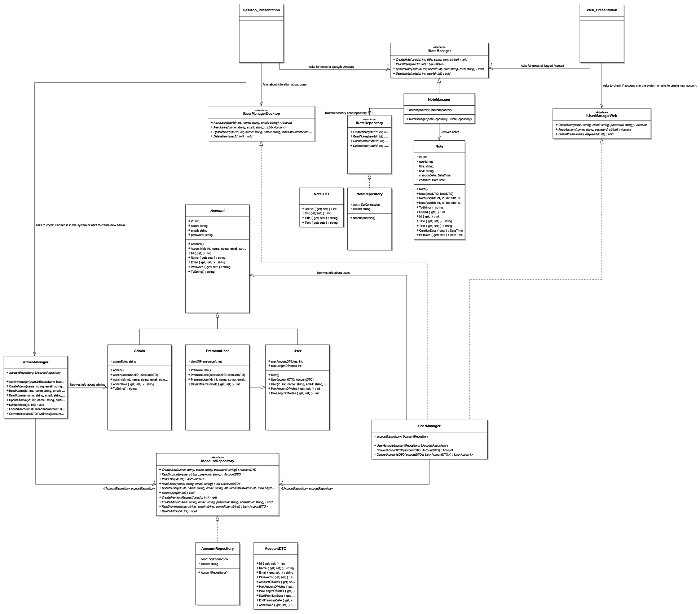

# Notes Aplication

Application for managing notes via desktop and web interface.

## Table of Contents

- [Notes Aplication](#notes-aplication)
  - [Table of Contents](#table-of-contents)
  - [About the Project](#about-the-project)
  - [Features](#features)
  - [Technologies Used](#technologies-used)
  - [Software Architecture](#software-architecture)
  - [Project Structure](#project-structure)
  - [Setup and Installation](#setup-and-installation)
  - [Contributors](#contributors)

## About the Project

**Course:** ICT & Software Engineering

**Semester:** 2

The project develops a software solution using .Net, ASP Razor Pages, Windows Forms Frameworks, and SQL Server to create notes management application.

## Features

- CRUD operations on notes
- User authentication system
- Role-Based access control
- Unit Tests

## Technologies Used

- **Programming Languages/Technologies:**
  - C#
  - SQL
  - HTML
  - CSS
- **Libraries/Frameworks:**
  - .NET 6.0
  - ASP.NET Core
  - Windows Forms
  - MSTest
  - Razor Pages
- **Tools:**
  - Visual Studio 2022
  - Git
  - GitLab
  - Microsoft SQL Server

## Software Architecture

The Notes Aplication System follows a 3-Tier Architecture to ensure modularity, scalability, and separation of concerns. The architecture consists of the following layers:

1. _Presentation Layer (**PL**)_: **Depends on the BLL Interfaces and <u>references DAL only for the use of Dependency Injection in Unit Tests</u>.**
   - _Web Interface (Razor Pages)_
   - _Desktop Interface (Windows Forms)_
2. _Business Logic Layer (**BLL**)_: Contains all the core business rules and application logic. **No dependencies.**
3. _Data Access Layer (**DAL**)_: This layer interacts directly with the database. It handles all CRUD operations and converts data into DTO's. **Depends on the BLL Interfaces**

```
+---------------------------------------+
|           Presentation Layer          |
|---------------------------------------|
|                                       |
|       Display generated content       |
|                                       |
+---------------------------------------+
                    |
                    |   Dependency Inversion
                    ▼
+---------------------------------------+
|         Business Logic Layer          |
|---------------------------------------|
|                                       |
|    Handles core application rules     |
|                                       |
+---------------------------------------+
                    ▲
                    |   Dependency Inversion
                    |
+---------------------------------------+
|          Data Access Layer            |
|---------------------------------------|
|                                       |
|    CRUD operations on SQL database    |
|                                       |
+---------------------------------------+

```



## Project Structure

```
synthesis-assignment/
|
├── Notes Application HTML      # Initial Designs
│
├── Notes Application           # .NET Solution
│   │
│   ├── NotesAplicationWeb      # PL Razor Pages Source Code
│   │
│   ├── NotesAplicationDesktop  # PL Windows Forms Source Code
│   │
│   ├── LogicLayer              # BLL Source Code with Interfaces for Dependency Inversion
│   │
│   ├── DataLayer               # DAL Source Code
│   │
│   └── UnitTestProject         # Unit Tests
|
└── README.md
```

## Setup and Installation

Follow the instructions below to set up the project on your local machine.

1. **Clone the Repository**
   ```
   git clone https://github.com/your-username/project-repo-name.git
   cd project-repo-name
   cd Notes\ Application
   ```
2. **Install Dependencies**
   ```
   dotnet restore
   ```
3. **Compile/Build the Project**
   ```
   dotnet build
   ```
4. **Run Unit Tests**
   ```
   dotnet test
   ```
5. **Run the Project**
   ```
   dotnet run
   ```

## Contributors

- [Grzegorz Malisz](https://github.com/grzgm): Author.
